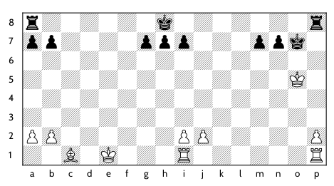
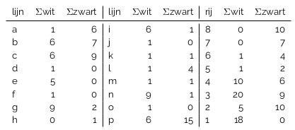
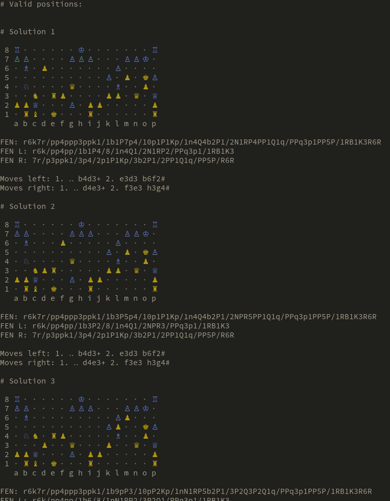

# AIVD kerstpuzzel 2021 18 solver

The Dutch secret service (AIVD) has a yearly puzzle challenge around Christmas,
called the '[AIVD kerstpuzzel][aivd-kerstpuzzel]'.

This repository holds a solver for challenge 18 of 2021.

## Challenge

Challenge description (in Dutch): [`./challenge.pdf`](./challenge.pdf)

Here's a rough translation of the challenge:

> The following board position is given:
>
> 
>
> This consists of two boards connected together. Both boards have the same
> challenge: mate in two with black to move.
>
> The given board position is incomplete however, you must add additional pieces
> on it to satisfy the following table with file/rank sums:
>
> 
>
> The complete board has the following pieces: k, k, q, q, b, b, n, r, r, p, p,
> p, p, p, p, p, p, p, p, p, en K, K, Q, Q, B, N, R, R, R, R, p, p, p, p, p, p, p,
> p, p, p, p.
>
> With the complete board position, find the moves for mate in two with black to
> move. The moves must fit the following algebraic notation:
> `1... ???+ 2. ?x?? ???#`.
>
> To solve the puzzle, find the board position (FEN notation) and the moves to
> play on both boards for mate in two using the notation format above.

Find all challenges for 2022 [here][aivd-kerstpuzzel-download].

## Solution

The solver finds 8 possible board positions, all with the same set of moves for
mate in two:



Find all 8 solutions in: [`./output.txt`](./output.txt)

## Requirements

To run this project, make sure you have:
- Rust: https://rustup.rs/
- Stockfish: https://stockfishchess.org/

On Ubuntu, use:

```bash
# Install Rust
curl --proto '=https' --tlsv1.2 -sSf https://sh.rustup.rs | sh

# Install stockfish
apt install stockfish
```

## Usage

Once you meet the [requirements](#requirements), simply run the project through
Rust's `cargo` and watch the output:

```bash
# Clone the project
git clone https://github.com/timvisee/aivd-kerstpuzzel-2021-18-solver
cd aivd-kerstpuzzel-2021-18-solver

# Compile and run
cargo run --release
```

[aivd-kerstpuzzel]: https://www.aivd.nl/onderwerpen/aivd-kerstpuzzel
[aivd-kerstpuzzel-download]: https://www.aivd.nl/onderwerpen/aivd-kerstpuzzel/documenten?trefwoord=&startdatum=01-12-2021&einddatum=31-12-2021&onderwerp=Alle+onderwerpen&type=Alle+documenten
